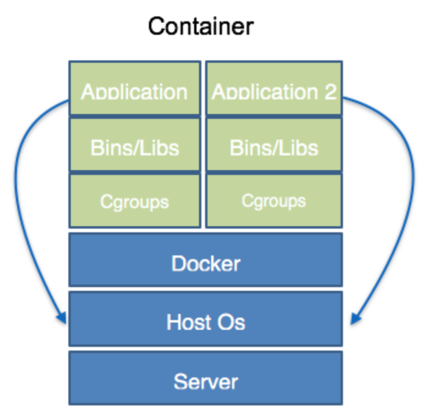
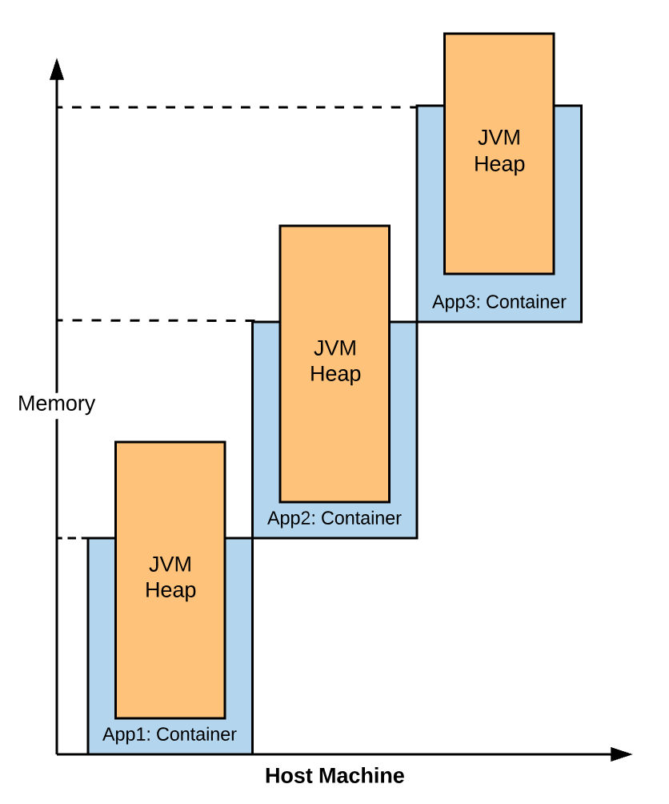
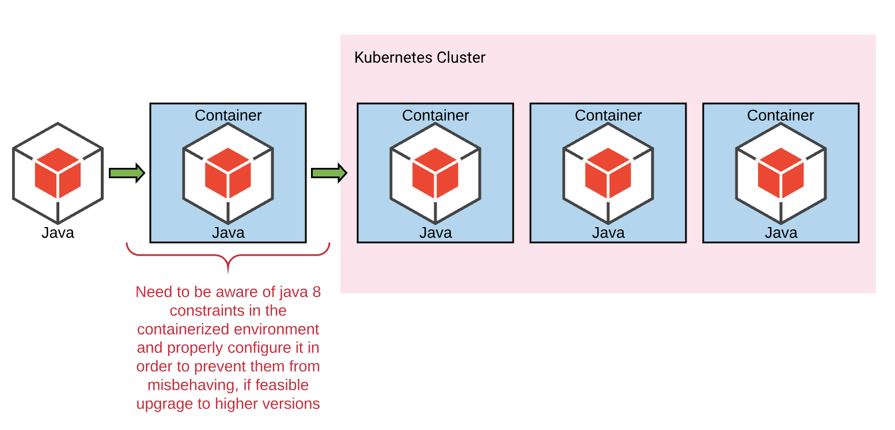

# JVM in docker

### What happens with Java 8 inside a container?
`docker run -m 250MB openjdk:8u131 java -XshowSettings:vm -version`

Docker containers running on a host are nothing but processes whose memory allocation is controlled using Cgroups. 
So, the host could have 3 GB memory but the container could be restricted to use only 500 MB.
But JVM (version 8) does not understand that it’s running inside the docker container and hence configures it’s resources based on the underlying OS.




### Moving to Java 8u131

JDK 8u131 has backported the ability of JVM to detect how much memory is available when running inside a Docker container from JDK 9

```
docker run -m 250MB openjdk:8u131 java \
  -XX:+UnlockExperimentalVMOptions \
  -XX:+UseCGroupMemoryLimitForHeap \
  -XshowSettings:vm -version
```

Even for JDK 9 we need to use the same options.

If we want to juice out even more of the available memory then use -XX:MaxRAMFraction=<1,2,3...> (where 1 will utilize 100% of avalilable memory and 2 will utilize 50%)
```
docker run -m 250MB openjdk:8u131 java \
  -XX:+UnlockExperimentalVMOptions \
  -XX:+UseCGroupMemoryLimitForHeap \
  -XX:MaxRAMFraction=1 \
  -XshowSettings:vm -version
```

### Moving to Java 10 & 11

No need to specify any experimental features, by default the JVM understands the container memory allocation by accessing the cgroups

```
docker run -m 250MB openjdk:10 java -XshowSettings:vm -version
docker run -m 250MB openjdk:11 java -XshowSettings:vm -version
```

# Testing in kubernetes

## Dockerize a java app and run it 
```
docker build . -t fill-heap:0.1 -f Dockerfile-java8-basic
docker run -d -m 250MB  fill-heap:0.1
docker run -d -m 250MB  -e JAVA_OPTS='-XX:+UnlockExperimentalVMOptions  -XX:+UseCGroupMemoryLimitForHeap  -XshowSettings:vm' fill-heap:0.1
```

To check the stats of the container running in background use `docker stats`

## For local kubernetes deployment

Start a local docker registry and deploy the docker image
```
docker run -d -p 5000:5000 --restart=always --name registry registry:2

docker tag fill-heap:0.1 localhost:5000/fill-heap:0.1
docker push localhost:5000/fill-heap:0.1
```
 Deploy the app on the k8 cluster
 ```
 kubectl apply -f local-deployment.yaml
 kubectl get pods
 kubectl top pod  # to check the memory usage
 ```
 <b>NOTE: This app is designed to fill the heap, so there is always a possibilty that things will get slow and might even hang. In some cases, the kubernetes cluster master might not even respond. Restart the docker desktop and delete the deployment if it tries to restart.</b>

Remove the earlier deployment and repeat the same for "java-app-aware", use `kubectl apply -f local-deployment-with-opts.yaml`

This time the app should get OOM'ed quickly as the JVM will understand the container memory restrictions. 

Finally, to remove the deployments use: 
`kubectl delete deployment <java-app/java-app-aware>`

## For GCP kubernetes deployment

Create a simple zonal 3 node cluster on the kubernetes engine. Once created connect using cloud shell and clone this repo (use https).

Build the docker image, tag it and push it to Google Container Registry
```
docker tag fill-heap:0.2 gcr.io/core-autobuilds-poc/fill-heap:0.2
docker push gcr.io/core-autobuilds-poc/fill-heap:0.2
```

Deploy the app on the k8 cluster
 ```
 kubectl apply -f deployment.yaml
 kubectl get pods
 ```
Use stackdriver logs to check the output of the deployment workload. The heap assigned to the app will be more than what the container can support (~800-900MB depending on the node specs you choose). The app should get killed by k8 as soon as it crosses 500MB mark. Remove it once done.

Deploy the container aware app on the k8 cluster
 ```
 kubectl apply -f deployment-with-opts.yaml
 kubectl get pods
 ```
Use stackdriver logs to check the output of the deployment workload. This time the app will hit OOM because it correctly configures the heap inside the container. Remove it once done.


### Why does all this matter?

When the JVM runs inside the container it configures it’s heap (even the thread pools) based on the underlying host os
In large hosts, heaps on these java apps can easily get configured to a higher value than what is prescribed at the container level. Orchestration solutions like Kubernetes will try to efficiently “pack” containers on each nodes based on "memory" and "cpu" usage of the individual containers. This creates problems because the memory usage can outgrow the container memory limits and the app gets killed by the orchestrator.



So, bottom line, we need to be aware of this scenario and appropriately configure our java apps before fully enjoying the awesome world of containers and orchestrators. 



-----

### Handy commands
`docker kill $(docker ps -q)`  # To kill all running docker processses